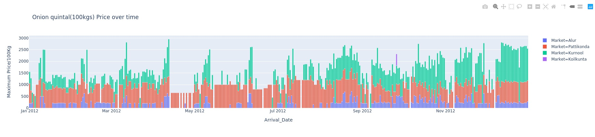
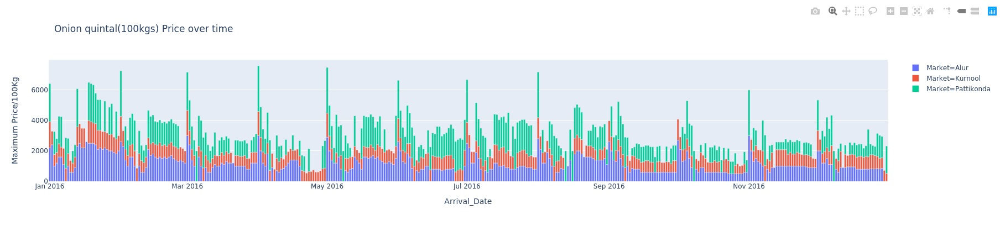
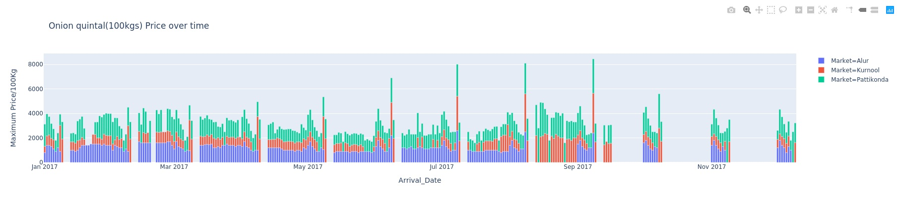
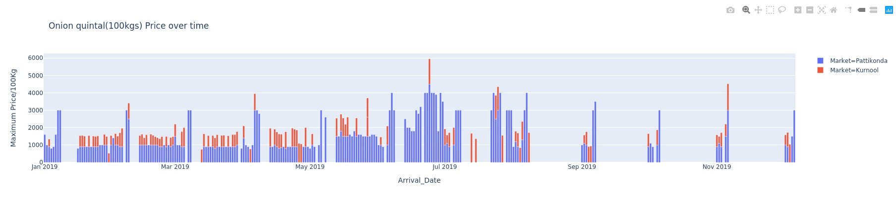

# Onion_Price_Analysis
Onion Price Analysis of over time 2012,2017,2016,2019 district  wise.
I tried to give aboslute way to give you the grapical view with simple changes.

## Prerequistes
[+] Linux

[+] Jupyter notebook

[+] Plotly

[+] Pandas

[+] python3

[+] imgkit

Simple data anlysis with minimum Libaries.
plotly is a data visualization libary with easy and simple parameters.

### Installation Steps
```sh
$apt-get install python3
$apt-get install python3-pip
$pip3 install plotly  pandas
$pip3 install imgkit
$apt-get install wkhtmltopdf
```

Jupyter notebook check at:https://jupyter.org/install
# Example Images: 
  # Kurnool District Price/100kg 2012


  # Kurnool District Price/100kg 2016


  # Kurnool District Price/100kg 2017


  # Kurnool District Price/100Kg 2019


# Elon On Fire


#### Note: Data I got is from :https://data.gov.in/catalog/variety-wise-daily-market-prices-data-onion
Check there for more information. sorry for missing data
   ## Thanks
  Student of [TomNomNom](https://github.com/TomNomNom)

